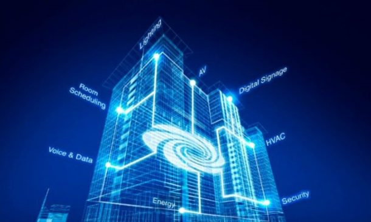
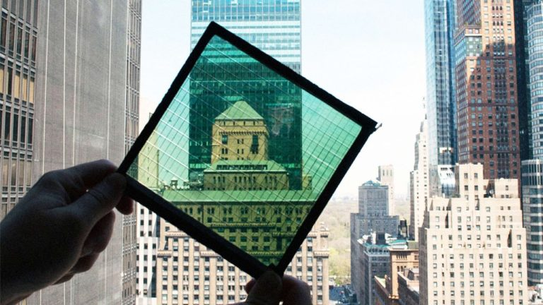
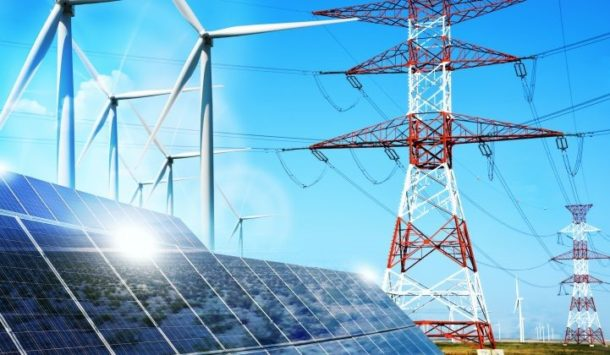

Picture an office that cleans up after itself, improves indoor air quality with nanotech-formulated paint, and responds to sunlight by magically adjusting window tint, all while fighting climate change. Then imagine entering your workspace to find your desk light on and the temperature just as you like it. Though it may sound like a scene from a fictional sci-fi movie, these innovations are already at work in some modern buildings, in the form of a networked ecosystem of “intelligent” building equipment and devices.

Beyond the “Wow!” factor and the large-scale benefits to our planet, green and smart building technologies are changing the way we live and work, and creating business opportunities for technology innovators, commercial building owners and tenants. Buildings designed with sustainability-supporting materials, Big-Data-crunching automated systems, and onsite clean energy are expected to represented 55 percent of all U.S. commercial and institutional construction in 2015, according to McGraw-Hill Construction’s Dodge Construction Green Outlook. Recent research from groups like CO2 Scorecard, demonstrate that these kinds of advancements in how people consume energy have contributed twice as much to the recent drop in U.S. GHG emissions as the reduced use of coal in favor of natural gas.

It’s no coincidence: sustained public interest in sustainability has triggered a surge of green building innovation. Spiraling water concerns and energy costs have sparked resource-efficient building operations among commercial property owners and occupiers. New regulations in many U.S. states and municipalities provide further motivation in the form of energy disclosure ordinances or tax incentives for sustainable construction and building operations. Also important is the growing body of research showing that green buildings are good for employee health and well-being. Corporate tenants are willing to pay higher rents for the resulting workplace productivity gains, while employees and consumers alike prefer companies that are socially and environmentally responsible.

Here are a few of the building technologies that are changing the game of greening the planet –and transforming our culture in the process.

##Nanotech Wonders: Paint that invisibly cleans air and more

    

Does the paint in your office clear the air? Now it can. A Philippines-based company, Pacific Paint (Boysen®) Philippines Inc. created the world’s first air-cleaning paint. It’s based on nanoscale titanium dioxide, used to reduce harmful emissions in power plants and motor vehicles. It interacts with light to break down nitrous oxide and volatile organic compounds (VOCs) into harmless substances.

Nanotechnology is also behind smart electrochromic glass windows that can respond to environmental conditions. These windows can be integrated with building automation systems and programmed, along with other building equipment, to utilize natural sunshine and heat to offset the need for artificial lighting and artificial heating from HVAC.

Nanotechnology can even improve hygiene: Adding silver nanoparticles to paint can add lasting antimicrobial properties, an infection-prevention technique borrowed from the medical world. The biocidal effect of the released silver ions prevents the growth of mold, algae and bacteria.

Innovation in materials science and production technologies has made green building materials a thriving industry sector, with the global market projected to reach $529 billion by 2020, according to research firm Global Industry Analysts. For example, one category of new creative sustainably produced products is fire-retardant insulation produced from would-be waste materials such as shredded denim, plastic milk bottles, newspapers, agricultural straw, hemp and flax.

##HAL 9000? More like the coolest treehouse ever

    

You arrive at your office building. The elevator is waiting for you as soon as you enter the lobby. It takes you straight to your floor without you pressing a button. You find your workspace ready for you, with lighting and temperature as you prefer, and your computer turned on for use. All this triggered when you parked your electric car in a wireless charging spot in the parking garage. Intelligent building automation systems are bringing this scenario to life today.

While it’s common to describe smart buildings as being driven by a brain, the future doesn’t really resemble HAL 9000—the sentient computer of Arthur C. Clarke’s 2001: A Space Odyssey. Instead, the intelligence is becoming increasingly distributed in an ecosystem of connected devices and equipment engaged in machine-to-machine (M2M) communications. Like natural habitats such as trees or coral reefs, the parts of the ecosystem of a building are specialized to serve distinct functions with minimal intervention from the users.

Today’s smart buildings house networks of interactive, programmable devices and equipment providing heating, cooling, elevators, lighting, security and more.

Smart lighting, in particular, has become has become a fast-growing Internet of Things category according to global technology research firm ON World. The firm predicts that, by 2020, 100 million Internet-connected wireless light bulbs and lamps will be installed. As one of best sources from which to save energy and improve workplace functionality, whole lighting systems can respond to the availability of natural light or presence of occupants spread across a building and automatically adjust in real-time down to the level of a single bulb.

While traditional building equipment in older buildings still lacks embedded intelligence, companies like Enlighted can leverage existing building management systems to introduce operation optimization algorithms to otherwise dumb equipment. The Silicon Valley-based global provider of end-to-end managed application services also uses cloud technology to connect the disparate building systems within a single building or across whole global portfolios. Combined with skilled facilities management staff, this level of integration opens new frontiers in how humans, machines and buildings can interact.

##Energy sourcing: onsite energy technology goes net zero

First the bad news: The United States generates more CO2 emissions than any country in the world except China; and commercial and residential properties generate approximately 40 percent of these emissions in the United States, according to the U.S. Green Building Council. Energy consumption is the driver of all this. With nearly 30 percent of the $202 billion spent annually on U.S. commercial and industrial energy wasted, it’s not surprising that energy efficiency is a priority for commercial property owners. In fact, investing $279 billion in U.S. building efficiency could save more than $1 trillion in energy costs over 10 years, with every dollar invested producing three dollars of operational savings, according to report from The Rockefeller Foundation and Deutsche Bank Group.

    

Now the good news: An energy efficiency call to action is being heeded. U.S. GhG emissions have declined by 10 percent since 2005 primarily thanks to energy efficiency. To further accelerate these reductions, we can compound the efficiency gains on the demand side with improvements on the supply side.

The transformation of energy markets from coal to natural gas – enabled in part by fracking – is already showing how quickly a low carbon energy supply impacts national greenhouse gas emissions. Building-integrated energy generation has the potential to be even more disruptive.

Adoption of onsite renewable energy technologies is rapidly increasing. Tax incentives and technological advances have made wind, geothermal and solar power installation, smaller, more powerful and more affordable today than in the past. They can even be incorporated into traditional building materials, substantially reducing installation and material costs. Solar power generating paint, windows, and road-surfacing materials are just a few of the applications for building component materials happening today.

Waste conversion technologies are also on the rise. New alternative options include biogas digesters that can turn methane from food waste into electricity. On a smaller scale, it is becoming common place for a building can to use refrigerator exhaust to heat water, heat exchangers to heat the building with the heat generated by office machines and computers, or drivers to convert the motion of vertical transportation systems into electricity. For existing buildings which are expensive to retrofit with these new advanced technologies, building owners can partner with renewable energy companies that will install and maintain energy equipment at no cost, in exchange for an energy-purchase agreement and the right to sell excess energy to the municipal grid. In fact, commercial property owners can use an energy matchmaking service that recommends the most cost-effective options, also at no cost to the property owner—a timely service, given the growing universe of highly technical solutions.

New renewable energy technologies, and falling prices for older technologies, have led to the emergence of “net-zero” and “Living Building” standards for environmentally friendly buildings. While exact definitions vary, the concept is that the total energy a building consumes annually is equal to or less than the amount of energy it creates. Most zero-energy buildings tap the public electrical grids for energy storage and backup power, but some are entirely independent. All rely on some form of renewable energy, combined with energy-efficient building design, systems and operation.

For all the advancements in building-integrated renewable energies, you might be wondering you haven’t heard of it having a bigger impact already. The truth is that the building-integrated energy generation sector hasn’t had its “fracking moment,” but that may be just around the corner. The biggest barrier to more wide-spread adoption is efficient energy storage, and solutions are coming. Startups are emerging around the world with innovative products. Even automakers like BMW are getting involved. Solving this issue will do as much for building-integrated and distributed energy as the development of Nikola Tesla’s AC current generators did for centralized district power nearly a century ago.

##The incredible shrinking power grid

    

Combined, the use of smart building technologies and renewable energy is displacing the traditional centralized power model with the technology-driven distributed energy concept. Today, a group of connected buildings can become its own energy self-sufficient microgrid, exchanging power among its members from diverse power sources. With the emergence of interactive smart grids in some communities, a smart building can even sell excess energy to the utility company.

The United States may even see the kind of market disruption that Germany is already experiencing, where renewable energy powers half of the country’s electricity-generating capacity, and the system of centralized power generation is up-ended, in favor of locally generated power.

These innovations in futuristic building technologies represent only the tip of the iceberg when it comes to greening the built environment. As demand for sustainably created and operated buildings continues to grow, we expect more exciting developments will move from the lab into actual practice.
