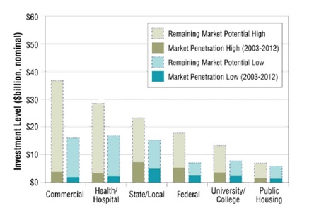
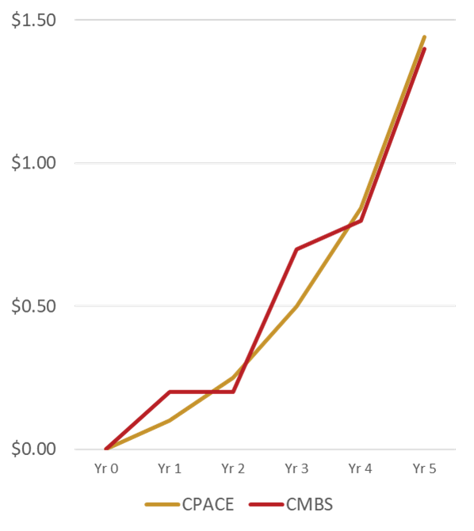

An innovation is quietly taking hold and it is on track to make today’s environmental design best practices the status quo before the end of the decade. Already, many of the nation’s largest property owners are using it to retrofit entire portfolios, while major developers are including it in all new construction. Universities are promoting it; think tanks are validating it; and business magazines singing its praises. Available in over 37 states, it can be used to replace old appliances just as easily as it can be used to install rooftop solar. It’s called Property Assessed Clean Energy, or PACE; and while you’ve probably seen it in the headlines, chances are that it’s not what you think it is.

PACE is a novel way to improve America’s building stock. For projects that don’t guarantee energy savings PACE transforms the standard ROI model based on payback periods into a question of cash flows. By offering borrowers long enough terms to ensure that the annual repayments are always less than the annual utility savings, PACE projects should always be cash flow positive within the first year after construction completion.

However, PACE isn’t a “source” of funds, per se. It’s a mechanism, through which funds are transferred from a capital provider to a government agency to a building and then repaid. This transfer process changes the accounting treatment of the funding, greatly improving a project’s economics while simultaneously aligning the ongoing utility savings with the upfront costs of the improvements. In essence, PACE is the first scalable solution to one of the great obstacles to environmental best practice in commercial real estate: the split incentive.

##Solving Problems with Taxes

    

In energy services parlance, split incentive refers to a standard clause in most net leases that obligate a tenant to pay for utility costs and a landlord to pay for building upgrades. Intuitively, this clause may make sense. After all, tenants use the utilities and upgrades increase the value of the landlord’s building. Except that most landlords own their buildings for a long time, often beyond the useful life of the upgrade; thus, they rarely collect a return on the added asset value. In fact, a building owner, keeping all the costs and giving away all the energy savings, may never see a positive return on the investment.

Therefore, it should be of no surprise that Lawrence Berkeley National Lab’s 2013 “Remaining Market Potential of the U.S. Energy Services Company Industry” found that commercial buildings only achieved a 10% adoption rate of energy efficiency technologies. Consequently, this sector of the economy accounts for a whopping 40% of energy consumption in the U.S. and is the largest source of carbon reduction potential in the country.

The power of PACE that solves the split-incentive paradox is its ability to convert project financing to property tax assessment financing, triggering an accounting treatment transformation with deep ramifications. While funds provided to the building must be repaid, the repayment obligation is treated as a property tax. Under most commercial leases, tenants pay the property tax either as a part of the rent or as a separate charge, placing them with de facto responsibility for repaying the cost of the project; thereby, closing the split-incentive gap.

What this means for commercial building owners is that they can access low-cost, private sector capital to pay for 100% of eligible projects, finance the cost of the project over time to ensure that the annual payments are less than the annual utility savings, and avoid split-incentive. The building is improved without any capital expenditure and operating expenses are reduced for either the tenant or the landlord – whoever is responsible for paying property taxes and utilities.

There is no catch; no fine print. This simple, yet eloquent mechanism called tax assessment financing currently funds public service projects – from new sidewalks to street lamps – in over 37,000 jurisdictions across America and has been doing so since 1736, when Benjamin Franklin proposed the idea to pay for a Philadelphia fire department. The novelty of PACE is that it is the nation’s first voluntary property tax-assessment, and it can be applied to individual buildings.

##Disrupting Commercial Real Estate

    

Imagine if building owners were perfectly incentivized to upgrade their buildings and energy efficiency technology adoption rates jumped from 10% to 90%. In addition to turning on one of the most prolific methods for reducing greenhouse gas emissions, PACE could unleash over $1 trillion dollars of investment that owners would direct towards important environmental upgrades. All the low-hanging fruit of energy and water efficiency optimization would immediately be picked; all deferred maintenance would be completed; and underutilized space, such as rooftops, would become lucrative opportunities for building owners to generate power or improve the tenant experience with green space. Such a future is not far off. Currently, the fastest growing source of financing in the U.S., PACE is following the same growth trajectory as CMBS, the largest source of financing in the U.S. for building projects.

As markets learn to use PACE at a meaningful scale, its impact will be felt across industries. Already, the earliest signs of disruption can be seen. Legacy interests in the banking community who view PACE as competition to their less eloquent loan products are beginning to offer PACE products. Contractors who quickly learned the basics of PACE are starting to grab market share from their less responsive and often much larger competitors, presenting themselves as PACE experts and offering a solution that sets them far apart.

Could PACE be the special ingredient that makes green buildings commonplace? Such a market shift is not without precedent. Before Power Purchase Agreements (PPAs) were introduced to the solar industry, rooftop solar was a luxury consumer product; however, the advent of the PPA made solar energy an economically attractive option for millions of building owners. Today, solar is the fastest growing new sources of power in the country and is positioned to become a material component of the overall power mix of the nation.

Having only developed the public sector infrastructure necessary to handle the cash streams over the last 3 to 5 years, PACE is still in its infancy; yet the depth of its potential is clear. Red and blues states across the country are passing legislation to enable it, making it the fastest growing financial tool in the U.S. As PACE goes mainstream, vendors who align with this disruptive tool will emerge as new industry leaders and products once thought to be luxuries will become the new standard.
