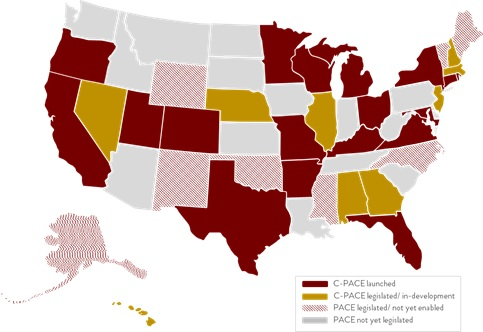
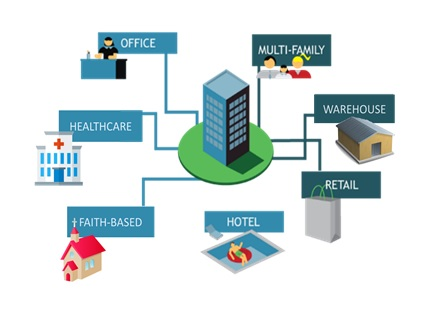
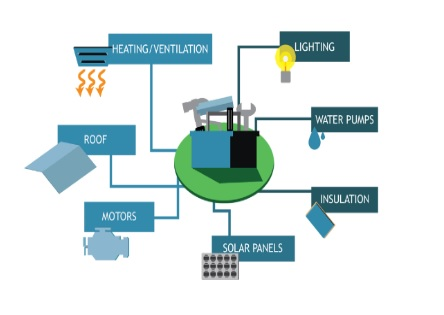
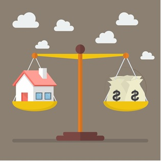

Commercial PACE funds are lent to borrowers to finance construction projects that improve the operational quality of a property; they are funded by private investors and banks; they give borrowers the option to take long repayment terms, up to 25 years; and they come with unique tax advantages that often make them the cheapest capital option available.

However, Commercial PACE is only available through government-sponsored programs. The rules of each program vary by state. Therefore, the application process can be very different from a traditional loan from a bank.

##1. Verify that there is a program in your area

    

The first step in getting PACE funding is to make sure that it is available in your area. Commercial PACE legislation has passed in over 37 states plus the District of Columbia; however, only 19 states plus D.C. have started a PACE program. To be able to receive PACE funding, your city needs to be part of a PACE program. One of the most up-to-date lists of towns with PACE programs can be found on the PACENation.org website. For businesses in D.C., Unety can help you verify that your area has a program. Just visit the Apply Now page of our website and enter your zip code.

##2. Verify that you can pay a property tax

    

While you can receive Commercial PACE for many property types, it’s not allowed for all types.
Specifically, you can’t get PACE on most government-owned properties. There are some exceptions to this rule in D.C., such as when government-owned land that is used by a private business under the terms of a ground lease. However, the borrower always needs to be able to pay a property tax. Most property owners, ground lessees, and tenants can pay a property tax; that includes places of worship. If you are a tenant under a net or gross lease, chances are you are already paying a property tax as either part of your rent or as a separate charge.

##3. Funds must be used to improve the operational quality of property

    

If a project costs at least $50,000; is fixed to a commercial property; and involves repairing, replacing, or newly installing equipment or materials that impacts either your water bill or your energy bill, chances are that it would qualify for PACE. From windows, walls, and roof work to HVAC, lighting, and plumbing to renewable energy, there is a very wide variety of projects that have received PACE financing. If you’re not sure about this one, that’s okay. Try out Unety’s cash flow calculator on the homepage page of our website. If the calculator shows you reducing your utility bills and you’re doing a project that’s on the list of preapproved project types, you’ll probably be fine.

##4. The value of the property must be high enough to protect the borrower

    

Most PACE programs include a rule that requires the value of the property to be high enough to protect the borrower if there is ever a default. For borrowers in most jurisdictions, the property must be 3 times the amount of the PACE for properties that are debt free, or 4 times the amount of the PACE for properties that have an existing mortgage. So, if you want to borrow $50,000, your property should be worth at least $200,000.

##5. The amount of debt on the property should not over burden the borrower

    

Another common consumer protection are rules that limit the amount of debt already on the property. This helps to ensure that the borrower is not over burdened by debt when they apply for PACE. In most jurisdictions, the debt limit is set at 85% of the value of the property, inclusive of PACE.

##6. No present threats of repossession
The final qualifications for receiving PACE funding relate to verifying that there are no risks that property ownership could be lost. The owner of the property must prove they have a clear title to the property (if you’re a tenant applying for PACE, your landlord will need to work with you and submit proof to your PACE lender). The lender may also check public records to verify that the property has not defaulted on taxes for at least three years and that there is no history of environmental contamination on the site.
